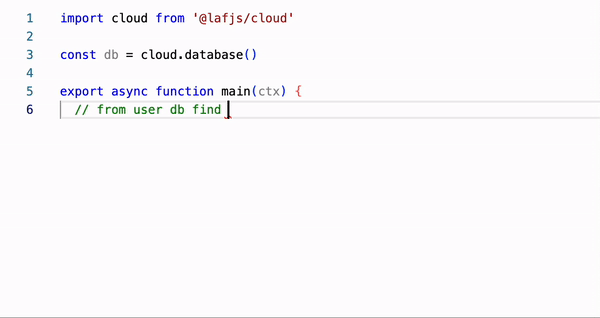

# Monaco Editor Copilot

Monaco Editor Copilot is a plugin for the Monaco Editor that integrates OpenAI's GPT-based code completion engine to provide a seamless and intelligent coding experience. This library is designed to work with the Monaco Editor and allows developers to easily configure and customize the plugin to suit their needs.




## Features

- Integration with OpenAI GPT-based code completion
- Customizable configuration options
- Optional custom completion function for use with other completion engines
- Automatically adjusts cursor style based on completion status
- Easy to add to any Monaco Editor instance

## Installation

```bash
# Using npm
npm install monaco-editor-copilot

# Using yarn
yarn add monaco-editor-copilot

# Using pnpm
pnpm add monaco-editor-copilot
```

## Usage

```javascript
import * as monaco from 'monaco-editor';
import MonacoEditorCopilot from 'monaco-editor-copilot';

const editor = monaco.editor.create(document.getElementById('container'), {
  value: '// Start typing your code here...',
  language: 'javascript',
});

const config = {
  openaiKey: 'your_openai_api_key',
};

const dispose = MonacoEditorCopilot(editor, config);
```

#### Keyboard Shortcut

Monaco Editor Copilot provides a keyboard shortcut to trigger the code completion feature. The keyboard shortcut is **Ctrl + B (or Cmd + B on macOS)**.

#### Disabling Copilot

If you need to disable the Copilot functionality, you can call the dispose function:

```javascript
dispose();
```

This will remove the Copilot functionality and clean up any associated resources.


#### More Examples
```javascript
//  with custom openaiParams
const config = {
  openaiKey: 'your_openai_api_key',
  openaiParams: {
    temperature: 0.8,
    max_tokens: 64,
  },
}

//  with custom assistant message
const config = {
  openaiKey: key,
  assistantMessage: 'use nextjs typescript',
},

//  with custom cursorStyle
const config = {
  openaiKey: 'your_openai_api_key',
  cursorStyleLoading: 'block-outline',
  cursorStyleNormal: 'block',
}

//  with customCompletionFunction
const config = {
  customCompletionFunction: async (code) => {
    return new Promise((resolve) => {
      setTimeout(() => {
        resolve('// example with customCompletionFunction\n');
      }, 1000);
    });
  },
}
```


## Configuration Options

#### The following options can be passed to the Config object:

| Option                     | Type                              | Description                                                  | Default                  |
| -------------------------- | --------------------------------- | ------------------------------------------------------------ | ------------------------ |
| `openaiKey`                | string                            | Your OpenAI API key (required for OpenAI-based completions). |                          |
| `openaiUrl`                | string                            | Custom OpenAI API URL (optional).                            | 'https://api.openai.com' |
| `openaiParams`             | OpenaiParams                      | Parameters for OpenAI completion (optional).                 |                          |
| `customCompletionFunction` | (code: string) => Promise<string> | Custom completion function (optional).                       |                          |
| `assistantMessage`         | string                            | Assistant message that helps complete the code. (optional).                     |   |
| `maxCodeLinesToOpenai`     | number                            | Maximum number of lines to send to OpenAI (optional).        |                          |
| `cursorStyleLoading`       | string                            | Cursor style during completion loading (optional).           | 'underline'              |
| `cursorStyleNormal`        | string                            | Cursor style when not loading completions (optional).        | 'line'                   |

#### The following options can be passed to the OpenaiParams object:
| Parameter | Type | Description | Default |
|-----------------------|---------|-----------------------------------------------------------------|-----------------------|
| `model` | string | The name of the OpenAI model to use for code completions. | 'gpt-3.5-turbo-0301' |
| `temperature` | number | Controls the randomness of the generated code. | 0 |
| `max_tokens` | number | The maximum number of tokens to generate in the completion. | 64 |
| `top_p` | number | Controls the diversity of completions using nucleus sampling. | 1.0 |
| `frequency_penalty` | number | Penalizes new tokens based on their frequency in the training data.| 0.0 |
| `presence_penalty` | number | Penalizes new tokens based on their presence in the input. | 0.0 |
| `stop` | Array<string> | A list of strings where the API will stop generating tokens. | |


## License

MIT License
